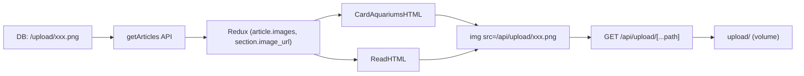

# План: API за upload снимки и показване в блога

## Контекст

- В базата се записват пътища като `/upload/1767370010013.png` (главна снимка и снимка по секции).
- Docker volume монтира host папката в контейнера като `/app/upload` (виж `docker-compose.yml`).
- `getArticles` вече връща `images` и за всяка секция `image_url`; `getArticlesSlice` запазва `article.images` и `article.sections[].image_url`.
- В момента карточките използват статична снимка; в страницата за четене секциите нямат показвана снимка.

## Поток

## Стъпки

### 1. API route за обслужване на файлове от `upload/`

- **Файл:** `app/api/upload/[...path]/route.ts` (нов).
- Логика:
  - При GET: взема `path` от `params` (масив от сегменти), прави безопасен файлов път с `path.join(process.cwd(), 'upload', ...path)`.
  - Проверка за directory traversal: отхвърляне на сегменти съдържащи `..` или празни; при невалиден path връща 400.
  - Чете файла с `fs.createReadStream` (или `fs.promises.readFile`) и го връща с подходящ `Content-Type` (напр. по разширение: `.png` -> `image/png`, `.jpg`/`.jpeg` -> `image/jpeg`, `.webp` -> `image/webp`). При липсващ файл връща 404.
  - Заглавки: `Cache-Control` (напр. `public, max-age=86400`) за кеширане.

За Docker: `process.cwd()` в контейнера е работната директория на приложението (напр. `/app`), така че `path.join(process.cwd(), 'upload', filename)` съответства на монтирания volume.

### 2. Помощна функция за URL на снимка (препоръчително)

- **Файл:** например `app/Helper-components/utils/imageUrl.js` или в съществуващ helper файл (ако има такъв).
- Функция: `getUploadImageUrl(path)` – ако `path` е не-празен стринг и започва с `/upload/`, връща `/api/upload/` + името на файла (без `/upload/`); иначе връща `null` или празен стринг. Така фронтендът не дублира логиката.

### 3. CardAquariumsHTML – главна снимка на статията

- **Файл:** `app/cardAquariums/CardAquariumsHTML.jsx`.
- В картата за статия се използва `style={{ backgroundImage: \`url(${img[7].url.src})\` }}` (ред ~74).
- Промяна: изчисляване на `imageUrl = getUploadImageUrl(article.images) || img[7].url.src` и използване на `url(${imageUrl})` за `backgroundImage`, така че при наличен `article.images` да се ползва снимката от upload, иначе fallback към текущата статична.

### 4. ReadHTML – снимка за всяка секция

- **Файл:** `app/ReadArticles/ReadHTML.jsx`.
- В цикъла по секции (ред ~146–152) се рендерират само заглавие и съдържание.
- Промяна: за всяка секция, ако има `section.image_url`, преди или след заглавието да се рендерира `` с подходящ клас (напр. съществуващите в `read.scss` за `.article-data img`). При липса на `image_url` да не се показва img.

### 5. Опционално: главна снимка в страницата за четене

- Ако искате главна снимка на статията в ReadHTML (отгоре), може да се използва първата налична от `article.images` (от Redux за текущата статия) със същата `getUploadImageUrl`. Това може да е отделна малка стъпка след 4.

## Файлове за промяна/създаване

| Действие | Файл |
|----------|------|
| Създаване | `app/api/upload/[...path]/route.ts` |
| Създаване (или в съществуващ helper) | Helper за `getUploadImageUrl` |
| Редакция | `app/cardAquariums/CardAquariumsHTML.jsx` |
| Редакция | `app/ReadArticles/ReadHTML.jsx` |

## Забележки

- Не се променя `getArticles` – данните остават в DB формат (`/upload/xxx.png`); преобразуването е само при показване на фронтенда.
- Ако в бъдеще в схемата има отделно поле за главна снимка на статия (напр. `articles.main_image_url`), в `getArticles/route.ts` трябва да се взима то и да се мапва на `images` вместо от първата секция; текущият план не променя заявката.
- Сигурност: API route да не приема `..` в path и да чете само от поддиректорията `upload/`.
